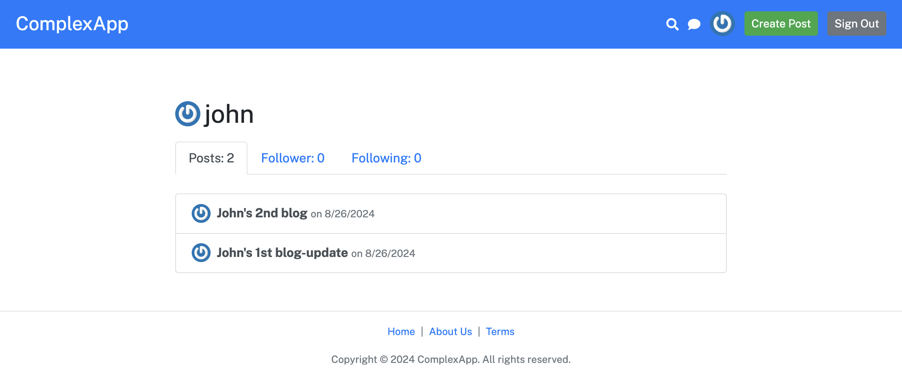
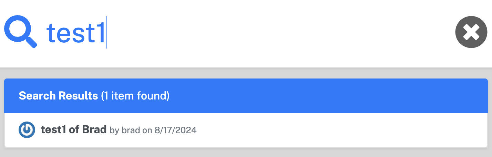
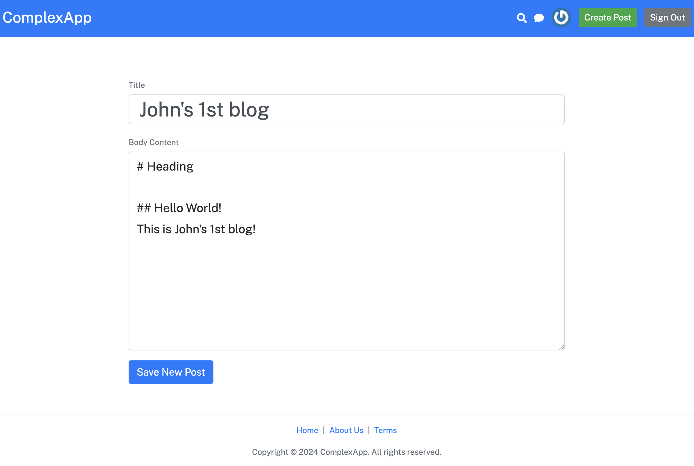
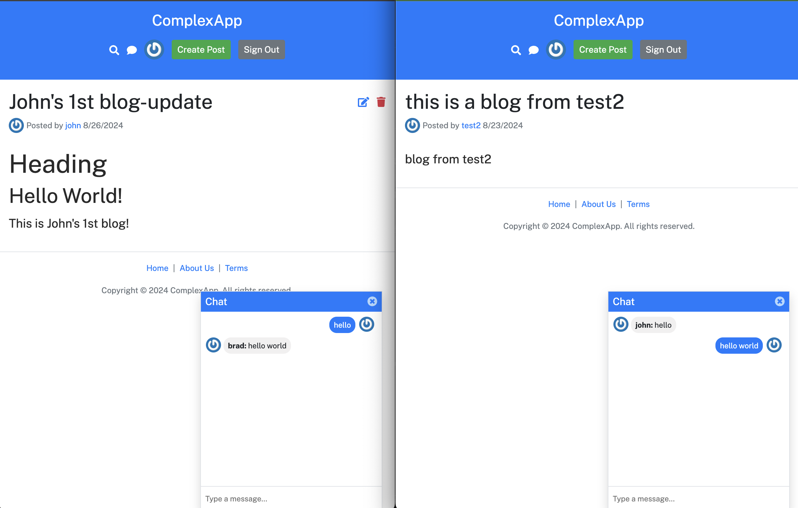
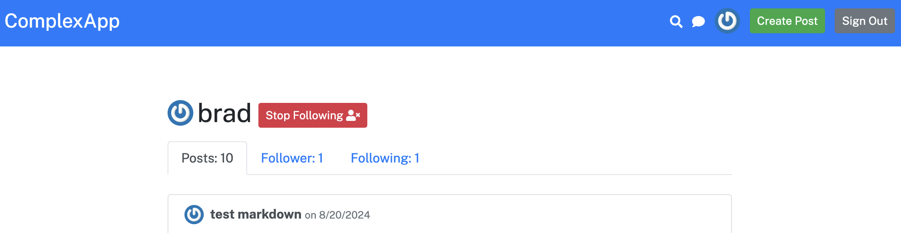

# React Forum App

😎 轻量且功能丰富的论坛应用程序

[English](README.md) | [简体中文](README-CN.md)

---

## 功能

1. **用户身份验证**: 安全的用户登录和注册功能。
2. **个人资料管理**: 编辑和管理用户个人资料，包括关注者和粉丝。
3. **创建和更新帖子**: 功能齐全的编辑器，用于创建和更新论坛帖子。
4. **Socket 聊天**: WebSocket 集成的实时通信功能。
5. **搜索功能**: 通过关键字快速查找用户和帖子。
6. **关注/粉丝系统**: 通过关注其他用户来管理您的社交圈。

---

## 截图


*登录和注册系统。*


*用户个人资料管理和关注系统。*


*搜索用户和帖子。*


*用于创建和更新帖子的编辑器。*


*通过 WebSockets 进行实时通信。*


*管理关注者和粉丝。*

---

## 安装步骤

1. 克隆项目仓库：

   ```bash
   git clone https://github.com/penn201500/ReactForum/
   ```

2. 进入项目目录：

   ```bash
   cd complex-react-app
   ```

3. 安装依赖：

   ```bash
   npm install
   ```

4. 创建一个 `.env` 文件，内容如下：

   ```env
   BACKENDURL=http://localhost:8080
   ```

5. 启动开发服务器：

   ```bash
   npm start
   ```

6. 构建生产环境代码：

   ```bash
   npm run build
   ```

---

## 技术栈

- React
- JSX
- Webpack
- Express
- Node.js
- MongoDB

---

## 许可证

此项目基于 MIT 许可证 - 有关详细信息，请参阅 [LICENSE](./LICENSE) 文件。
