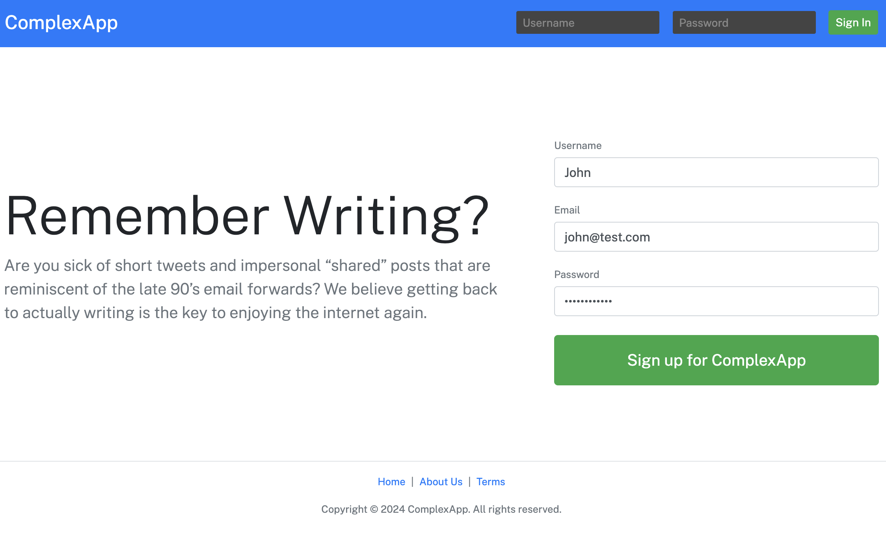
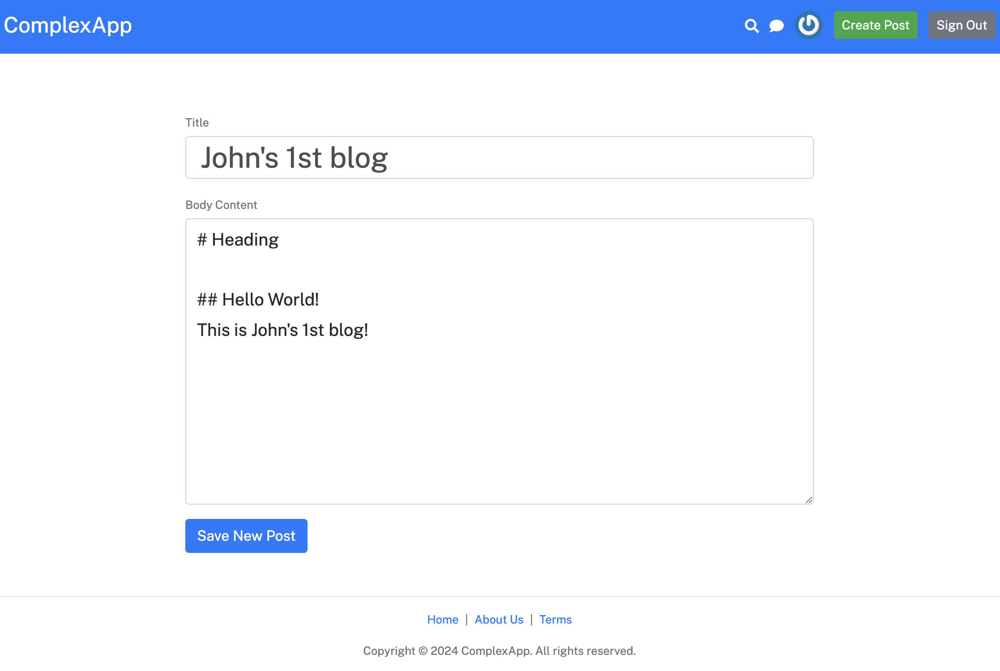
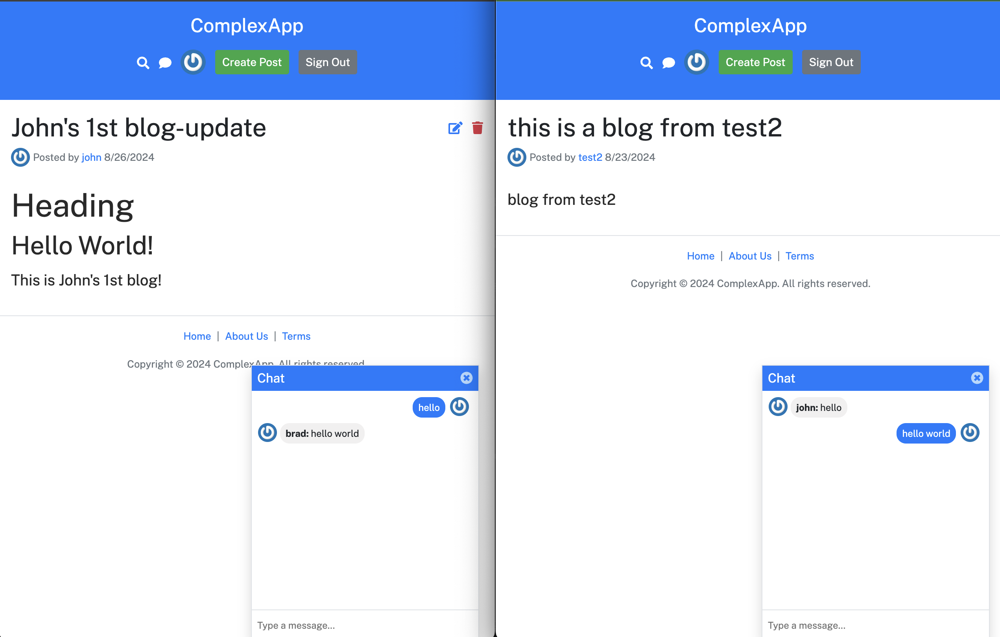
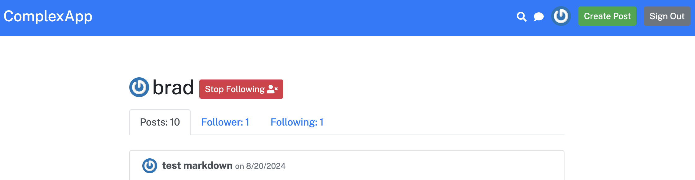

# React Forum App

😎 Lightweight & Feature-Rich Forum Application

[English](README.md) | [简体中文](README-CN.md)

---

## Features

1. **User Authentication**: Secure login and registration for users.
2. **Profile Management**: Edit and manage user profiles, including following and followers.
3. **Create & Update Posts**: Fully featured editor for creating and updating forum posts.
4. **Socket Chat**: Real-time communication powered by socket.io.
5. **Search Functionality**: Quickly find users and posts by keywords.
6. **Follower/Following System**: Manage your social circle by following other users.

---

## Screenshots


*Login and registration system.*


*User profile management and following system.*


*Search users and posts.*


*Editor for creating and updating posts.*


*Real-time communication with WebSockets.*


*Manage followers and following.*

---

## Installation

1. Clone the repository:

   ```bash
   git clone https://github.com/penn201500/ReactForum/
   ```

2. Navigate to the project directory:

   ```bash
   cd complex-react-app
   ```

3. Install dependencies:

   ```bash
   npm install
   ```

4. Create a `.env` file with the following content:

   ```env
   BACKENDURL=http://localhost:8080
   ```

5. Start the development server:

   ```bash
   npm start
   ```

6. Build for production:

   ```bash
   npm run build
   ```

---

## Technologies

- React
- JSX
- Webpack
- Express
- Node.js
- MongoDB

---

## License

This project is licensed under the MIT License - see the [LICENSE](./LICENSE) file for details.
